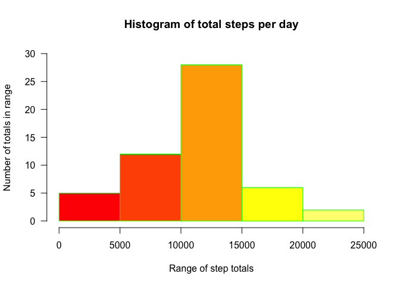
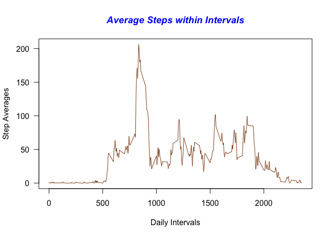
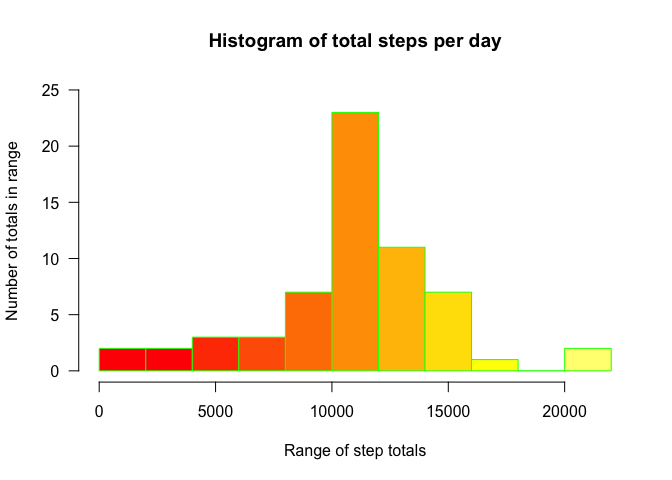
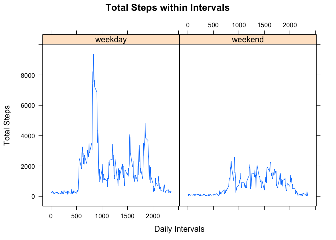

Introduction
============

This assignment makes use of data from a personal activity monitoring
device. This device collects data at 5 minute intervals through out the
day. The data consists of two months of data from an anonymous
individual collected during the months of October and November, 2012 and
include the number of steps taken in 5 minute intervals each day.

Data
====

The data for this assignment can be downloaded from the course web site:

Dataset: Activity monitoring data \[52K\]

The variables included in this dataset are:

-   steps: Number of steps taking in a 5-minute interval (missing values
    are coded as 𝙽𝙰)
-   date: The date on which the measurement was taken in YYYY-MM-DD
    format
-   interval: Identifier for the 5-minute interval in which measurement
    was taken

The dataset is stored in a comma-separated-value (CSV) file and there
are a total of 17,568 observations in this dataset.

Loading and preprocessing the data
==================================

The first step in the project, after downloading the data and unpacking
it to the local file system, is to read it into R using read.csv;
stringsAsFactors is set to FALSE so that dates are not factors but
strings that will be converted to dates later.

    activity  <- read.csv("activity.csv", stringsAsFactors = F)

What is mean total number of steps taken per day?
=================================================

Using `dplyr` library is going to be convenient. First, I loaded the
`dplyr` library.

    suppressMessages(library(dplyr))
    library("dplyr")

The data contains NA values. I created a new dataset with NA values
removed from it. `complete.cases` method returned only those days for
which step counts were recorded.

    complete_days_only <- activity[complete.cases(activity), ]

The analysis is peformed useing the `group_by` and `summarise` functions
from `dplyr`. The sum can be calculated using `summarise` once the data
has been organized by date using `group_by`

    step_summary  <-  complete_days_only %>% 
                      group_by(date) %>% 
                      summarise(daily_step_count = sum(steps))

Next I made a plot for total number of steps taken per day.

    hist(step_summary$daily_step_count, 
        main = "Histogram of total steps per day",
        xlab = "Range of step totals",
        ylab = "Number of totals in range",
        border = "green",
        col = heat.colors(5),
        las = 1,
        ylim = c(0, 30))

Next I calculated and reported mean and median of total number of steps
taken per day.

    sprintf("MEAN of the total number of steps taken per day: %s", mean(step_summary$daily_step_count))

    ## [1] "MEAN of the total number of steps taken per day: 10766.1886792453"

    sprintf("MEDIAN of the total number of steps taken per day: %s", median(step_summary$daily_step_count))

    ## [1] "MEDIAN of the total number of steps taken per day: 10765"

What is the average daily activity patern?
==========================================

What was the average number of steps taken in each interval within each
recorded interval across all days in each of the two months? I used
`group_by` for each interval and then took the mean of the steps in each
interval.

    x  <- complete_days_only %>% 
          group_by(interval) %>% 
          summarise(avg_interval = mean(steps))

I ploted the results to see the distribution of the averages.

    plot(x$interval, 
         x$avg_interval, 
         type = "l", 
         las = 1, 
         col = "chocolate4", 
         main = "Average Steps within Intervals",
         col.main = "blue",
         font.main = 4,
         xlab = "Daily Intervals",
         ylab = "Step Averages"
         )

The `which.max` function gave the interval with highest number of
average steps

    x[which.max(x$avg_interval), ]

    ## Source: local data frame [1 x 2]
    ## 
    ##   interval avg_interval
    ##      (int)        (dbl)
    ## 1      835     206.1698

The highest average number of steps was found in interval 835 and had
the value 2061698.

Inputing Missing Values
=======================

The number of NA values was calculated using the `nrow` function against
both the original and reduced datasets.

    nrow(activity)

    ## [1] 17568

    nrow(complete_days_only)

    ## [1] 15264

The number of missing observations is the difference between the two, or
2304.

I used a simple random number generator to impute values for missing
values observations. Using `set.seed` resulted in the same set of
integers being produced for subsequent runs and supported the concept of
reproducible research. The max value is divided by 10 provide reasonable
scale to these values, which can get quite large and skew the results in
a different way than the missing values can.

    set.seed(1234)
    z  <- floor(runif(nrow(activity), 
                      min = min(activity$steps, na.rm = T), 
                      max = max(activity$steps, na.rm = T)/10))

Next the indices of the missing values are determined. The use of a
separate vector to hold these results rather than include them inline in
the mutation code is done for readability.

    w  <- which(is.na(activity$steps))

Finally, the missing values for the number of steps are replaced with
corresponding entries from the integer vector.

    activity$steps[w]  <- z[w]

How does imputing values for missing data affect the results obtained
earlier with the reduced dataset? The same calculations for total steps
per day can be calculated against the augmented dataset and the results
plotted via a histogram.

    complete_data  <- activity %>% 
                      group_by(date) %>% 
                      summarise(daily_step_count = sum(steps))

And here is the plot:

    hist(complete_data$daily_step_count, 
        breaks = 10,
        main = "Histogram of total steps per day",
        xlab = "Range of step totals",
        ylab = "Number of totals in range",
        border = "green",
        col = heat.colors(12),
        las = 1,
        ylim = c(0, 25))

Once again, the mean and median can be easily calculated from the daily
totals, and the mean of all the steps over the two-month period is
10858.38 while the median is 11196. The imputed data had a negligible
affect on both the mean and the median calculated values. The data did,
however, produce a gap in recorded values for the range between 18000
and 20000.

Are there differences in activity patterns between weekdays and weekends?
=========================================================================

To answer this question, the date variable has its values converted to
dates.

    activity$date <- as.POSIXct(activity$date)

In order to separate the data into weekday and weekend subsets for
analysis, the date variable is input to the `weekdays` method and that
output is checked against a vector of weekend day names. The appropriate
text is added as a new column to the dataframe. This column is then
converted to a factor using the `as.factor` method.

    activity$dayType  <- ifelse(weekdays(activity$date) %in% c("Saturday", "Sunday"), "weekend", "weekday")
    activity$dayType  <- as.factor(activity$dayType)

To prepare the data for plotting, the dataset with imputed values is
organized first by dayType (weekday, weekend) and then by interval. A
sum of the steps recorded within those time intervals for each dayType
is then computed.

    q  <- activity %>% 
          group_by(dayType, interval) %>% 
          summarise(daily_step_count = sum(steps))

I created a time series plot using the lattice package so that the
independent/dependent variables can be conditioned by the factor
variable dayType.

    library(lattice)
    with(q, 
          xyplot(daily_step_count ~ interval | dayType, 
          type = "l",      
          main = "Total Steps within Intervals",
          xlab = "Daily Intervals",
          ylab = "Total Steps"))

It would appear from the output of the graph that this person spent a
great deal of time relaxing on the weekends after walking so much during
the week.
